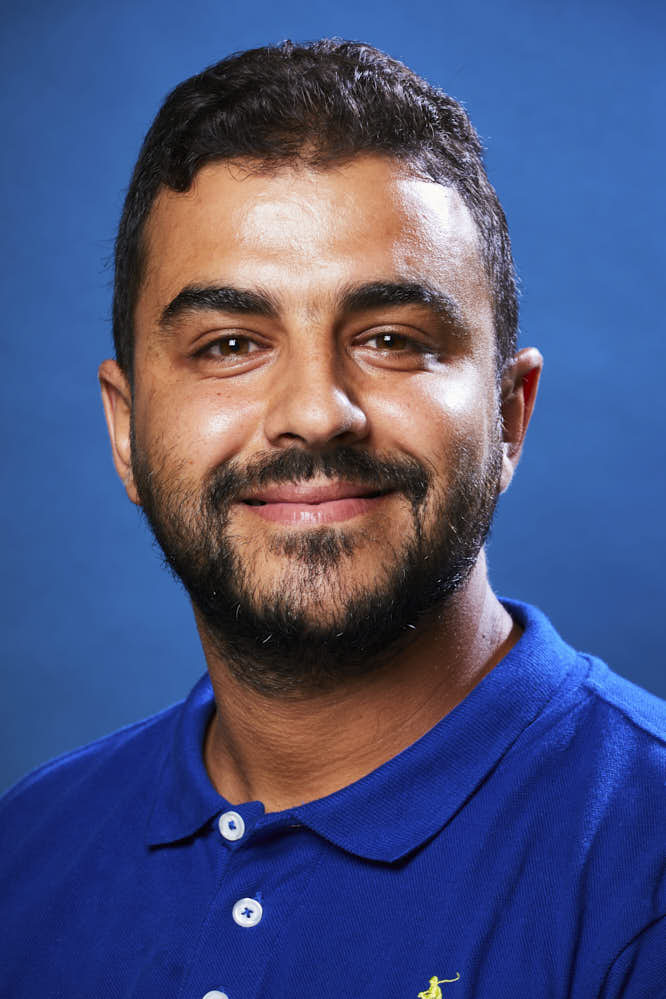

<!-- Colonne gauche : photo carrée + nom + ESME Lyon -->

:::::: {style="display: flex; align-items: flex-start; gap: 2em;"}
:::: {style="text-align: center; width: 200px;"}

<h2>Bilel Bousselmi</h2>

ESME Lyon

::::

<!-- Colonne droite : description -->

::: {style="flex: 1;"}
<h3>Situation actuelle</h3>

Je suis un **enseignant-chercheur à l'ESME Sudria Lyon** et **vacataire à l'IUT Lumière, Université Lyon 2** depuis Septembre 2023.

Mes thématiques de recherche sont : analyse des données de survie, données censurées, données manquantes, régression paramétrique et non paramétrique, estimation à noyau, régression Ridge et Lasso, régression quantile, régression expectile.

<em> Voici mon <a href="files/cv.pdf" target="_blank">CV</a> ainsi que mon <a href="files/manuscrit.pdf" target="_blank">manuscrit de thèse</a>. </em>

<!-- espace entre CV/Manuscrit et Contact -->   

<h3>Contact</h3>

**Adresse professionnelle :**\
Deuxième étage, Bureau 207\
16 Rue Jean-Marie Leclair\
69009 Lyon, France

**Mail personnel :** bilel.bouselmi\@gmail.com\
**Mail professionnel :** bilel.bousselmi\@esme.fr / bilel.bousselmi\@univ-lyon2.fr
:::
::::::
